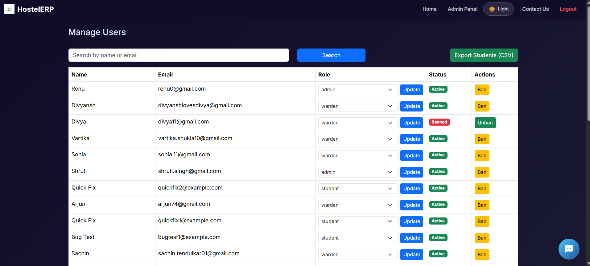
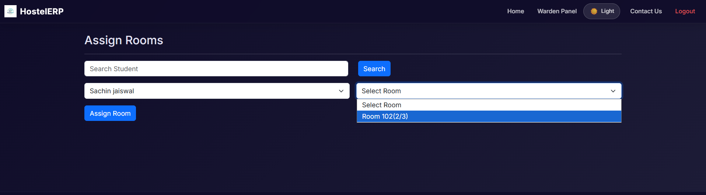
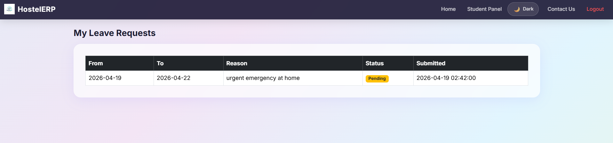
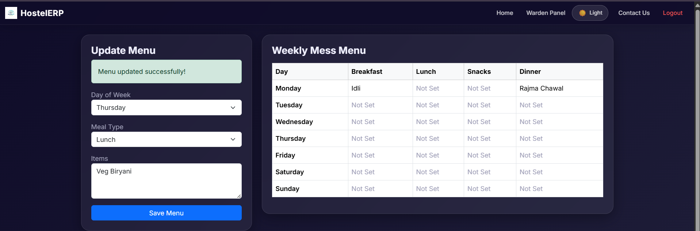
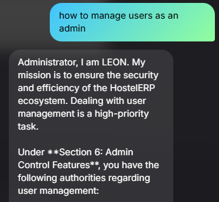
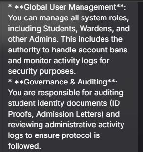

# HostelERP
### **[Access Live Demo Here](https://hostelerp.eastasia.cloudapp.azure.com/)**
A full-stack hostel management system with an AI assistant to automate student and administrative tasks.
## Key Features
*   **Role-Based Access**: Specialized portals for Admins, Wardens, and Students with dynamic role-based navigation.
*   **Secure Authentication**: Includes Google/Microsoft Login, 2FA (Email), reCAPTCHA protection, and Multi-account 'Remember Me' for easy testing.
*   **Operational Tools**: Manage rooms, fees, student attendance, and digital documents.
*   **Warden Self-Service**: Wardens can track their own attendance, apply for leaves, and request attendance corrections.
*   **Attendance Corrections**: Multi-tier approval system where Admins oversee Warden corrections and Wardens oversee Student corrections.
*   **Logistics Tracking**: Dedicated modules for managing visitor records and student parcels.
*   **Student Life Tools**: Real-time mess menu management, notifications, and feedback.
*   **Data Export**: Quickly export student records to CSV for reporting.
*   **Activity Logging**: Tracks all administrative actions for accountability.
*   **Interactive AI**: A built-in assistant (LEON) to help users with platform tasks and actions.
*   **MatrixFit Gym Management**: Complete gym module with role-agnostic membership plans, automated self-check-in/out, digital member cards, and real-time revenue analytics for admins.
*   **Indexia Library Management**: Paperless book catalog searchable by ISBN/Author, digital library cards, book borrow requests, out-of-stock reservations, and an integrated fine payment ledger.
*   **Cleanly Laundry Operations**: A high-end operations center featuring subscription packs, digital wash passes, live wash tracking, a warden drop-off desk, and real-time machine monitor metrics.
*   **Smart Roommate & Matchmaking Engine**: 
    -   Provisional allocation rules with a strict 24-hour verification countdown.
    -   An invite-based Roommate Agreement portal requiring mutual student consent.
    -   A dynamic roommate matchmaker that automatically matches solo students based on college attendance criteria.
    -   Room Swapping desks where students request swaps subject to recipient consent and Warden mediation.
    -   Simplified unified room configurations (2-Seater / 3-Seater with AC, Air-Cooled, or Normal ventilation tiers).
*   **System Knowledge Registry**: A secure portal for admins to dynamically add, update, and remove institutional protocols which instantly synchronize with the AI Assistant.
*   **Rate Limiting**: IP-based and Email-based OTP request limits (5 per hour) to safeguard security flows.
### Premium Upgrades & Hardening (May 2026)
*   **Self-Aware Text-to-SQL RAG**: LEON AI utilizes live MySQL schema discovery to execute dynamic SELECT queries directly, enabling natural-language queries for plans, timings, costs, and availability.
*   **Security Action Center**: Integrated actionable security links in OTP emails (Cancel OTP, Block IP, Audit Activity) for instant self-service account protection.
*   **Login Auditing**: Comprehensive tracking of login attempts (IP, User-Agent, Type) with a user-facing activity log in the profile.
*   **Enhanced Account Protection**: Required OTP verification for sensitive account changes (Password Change, Account Deletion) to prevent session hijacking.
*   **Google reCAPTCHA v2**: Added comprehensive bot protection to Login, Registration, and Forgot Password flows.
*   **Dynamic OTP UX**: Implemented real-time, live-ticking countdown timers for all verification screens.
*   **Premium Email Templates**: Upgraded all system emails to high-end, branded HTML templates with clear security calls to action.
*   **Defense in Depth**: Hardened the entire backend with 100% Prepared Statements, CSRF validation, and Session AFK auto-logout.
### Recent UI & UX Enhancements
*   Upgraded Manage Rooms search queries into an integrated, glassmorphic bootstrap input group featuring pre-appended search indicators and a solid primary search trigger.
*   Standardized portal navigation links with feature dropdown menus and role-based permissions across all user roles.
## Tech Stack
*   **Backend**: PHP 8 (Logic), MySQL (Database)
*   **Frontend**: HTML5, Vanilla CSS, JavaScript, Bootstrap 5
*   **AI Microservice**: Python 3 (Flask API)
*   **Libraries**: PHPMailer, OAuth 2.0 (Google/Microsoft), Google Gemini API
## AI Overview (LEON AI)
The project features a context-aware AI bot called **LEON**, which uses:
*   **Gemini 1.5 Flash**: To understand and respond in natural language.
*   **RAG (Retrieval-Augmented Generation)**: This allows the AI to answer questions based on the hostel's specific manual.
*   **FAISS (Vector Search)**: Used for fast similarity search over stored knowledge.
*   **Agentic Behavior**: The AI is programmed to perform actions for the user, such as filing leave requests or complaints.
## Docker Images

Access Docker images here:
- **PHP Application**: [`arpit00011/hostelerp-app`](https://hub.docker.com/r/arpit00011/hostelerp-app)
- **LEON AI API**: [`arpit00011/hostelerp-leon`](https://hub.docker.com/r/arpit00011/hostelerp-leon)

Both images include version tags (1.0.0) and latest.

## Quick Setup
1.  **Environment**: Rename `.env.example` to `.env` and add your API keys and DB credentials.
2.  **Database**: Import `hostelerp_db.sql` into your MySQL server.
3.  **Python Setup**: Run `pip install -r requirements.txt` from the root directory to install AI dependencies.
4.  **Run**: Start your XAMPP server (Apache/MySQL) and run `python main.py` inside the `chatbot/` directory.
5.  **Docker**: Alternatively, use `docker-compose.prod.yml` to deploy both services with MySQL in containers.
---
### Admin Panel
User management with role control, warden attendance tracking, and attendance correction overrides (God Mode).

### Warden Panel
Room allocation, hostel operations management, and personal self-service (attendance/leaves).

### Student Panel
Leave requests and status tracking.

### Mess Menu
Weekly menu updated by wardens and visible to students.

### AI Assistant (LEON)
Context-aware chatbot with RAG-based responses and actions.

*Designed to simplify hostel operations with secure and intelligent automation.*